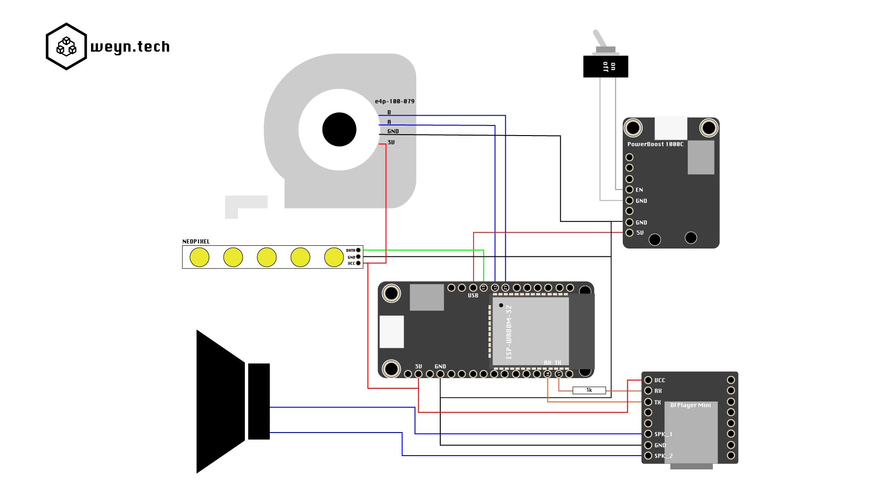

# "One and a half meters" social distancing tape measure
My answer to Henk Rijckaert's #tapemeasurechallenge. A COVID19 tape measure that is red when it is unrolled less than 1.5m and green above 1.5m. He also says "one and a half meters" if the distance is exceeded. In this video I also explain the operation and use of an optical encoder.

## Hardware coponents

* Optical Encoder: [e4p-100-079](https://www.usdigital.com/products/discontinued/E4P)
* Audio: [DFPlayer Mini](https://wiki.dfrobot.com/DFPlayer_Mini_SKU_DFR0299)
* Power: [PowerBoost 1000C](hhttps://www.adafruit.com/product/2465)
* MCU: [Adafruit HUZZAH32 - ESP32 Feather](https://learn.adafruit.com/adafruit-huzzah32-esp32-feather/overview)
* Neopixel

### Videos (dutch)

* [Youtube](https://www.youtube.com/watch?v=F3zZgtYZDA8&cc_load_policy=1&cc_lang_pref=en)

## Schematics

